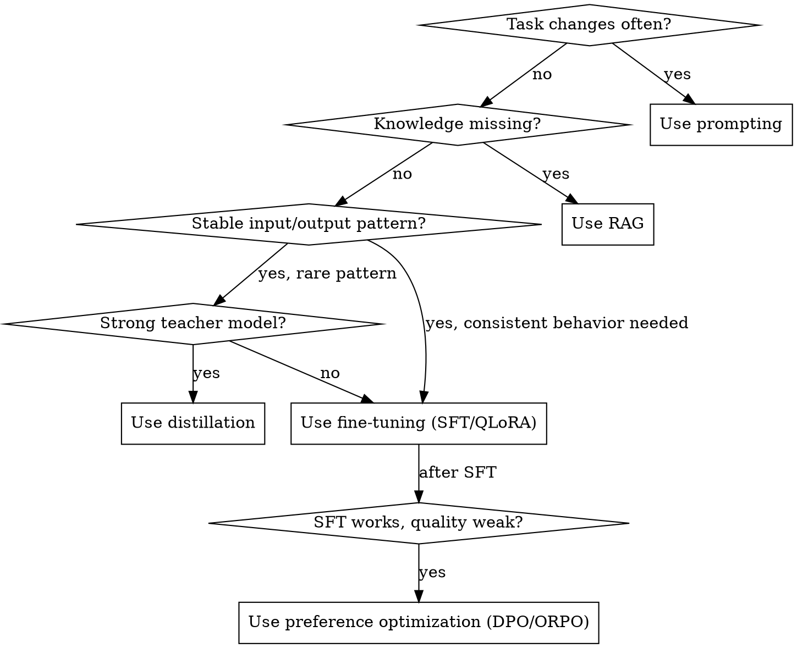

# Small Model Fine-Tuning

Turn a narrow AI task into a cheaper, faster, more reliable specialist model.

> Prompting tells a model what to do at runtime. Fine-tuning compiles repeated behavior into a smaller model so it can do one job cheaply, quickly, and consistently.

The moat is the dataset factory, not the fine-tune itself.

## When to Use This Skill

- Fine-tuning a 0.5B–13B open-source model for a narrow task
- Building a synthetic dataset pipeline
- Replacing expensive large-model inference with a smaller model
- Exporting to GGUF and serving with llama.cpp / Ollama
- Prototyping on Apple Silicon before scaling to cloud GPUs

Do **not** use when the task needs broad general reasoning, the user has no clear input/output contract, or no eval set exists and the user refuses to create one.

## First Principle

Fine-tuning is not the first step.

1. Define the task.
2. Define the output contract.
3. Build the eval set.
4. Build a baseline.
5. Build the dataset factory.
6. Train the smallest reasonable model.
7. Evaluate against baselines.
8. Quantize and test deployment behavior.
9. Iterate from failure cases.

**If the user skips to training without an eval set, redirect them to data and eval design first.**

## Decision Tree

**Use prompting** when: task changes frequently, output style flexible, fewer than 50 examples, latency/cost not a problem.

**Use RAG** when: main problem is missing knowledge, answers must cite changing documents.

**Use fine-tuning** when: stable pattern, strict format required, same behavior millions of times, prompting too expensive/slow.

**Use distillation** when: strong teacher already works, user wants cheaper student, output space narrow enough for imitation.

**Use preference optimization** when: SFT correct but quality, tone, or safety is still weak.

## Sub-Skills — Load Based on the Task

| Sub-Skill | Load When |
|---|---|
| `small-model-finetuning/select-a-model` | Choosing model size, family, instruct vs base, mlx-community variants |
| `small-model-finetuning/datasets` | Dataset formats, quality gates, volume heuristics, generation/judge prompts |
| `small-model-finetuning/lora-hyperparameters` | QLoRA recipe, rank/alpha/LR tuning, overfitting/underfitting diagnosis |
| `small-model-finetuning/training-stack` | Default stack, mlx-tune Mac prototyping, 10-step workflow, cost model |
| `small-model-finetuning/evaluation` | Baselines, metrics by task type, release gates, failure diagnosis |
| `small-model-finetuning/deployment` | GGUF export, quantization, Ollama, production flywheel, model card |

## Agent Behavior

Always ask or infer:
1. What is the exact task?
2. What is the output contract?
3. What examples exist?
4. What metric matters?
5. What baseline must be beaten?
6. Where will it run?
7. What is the latency and cost target?
8. What is the acceptable failure mode?

Make a reasonable first-pass assumption and label it clearly if information is missing. Do not block progress with too many questions.

## Anti-Patterns

- Training before evals.
- Generating huge synthetic datasets before testing 500 examples.
- Reporting training loss as success.
- Comparing fine-tuned model only against the untuned base.
- Ignoring deployment behavior after quantization.
- Mixing chat templates.
- Training on malformed assistant outputs.
- Overfitting to synthetic style.
- Treating LLM judge scores as the only metric.
- Using production data without privacy review.
- Re-fine-tuning models sequentially on different datasets (consolidate first).
- On Mac: exporting GGUF from a 4-bit quantized base without a workaround.

## Practical One-Day Plan

| Hour | Work |
|---|---|
| 1 | Define task, output schema, 20 manual examples, eval metrics |
| 2 | Create 100 dev examples, run base model + prompted base, save baseline |
| 3 | Write generation prompt, generate 500 examples, validate/dedupe, inspect 50 |
| 4–5 | Run QLoRA on 0.5B–4B model, save adapter, track config |
| 6 | Run dev eval, compare against baseline, inspect failures |
| 7 | Generate targeted examples for top 3 failure clusters, retrain |
| 8 | Merge adapter, export GGUF, run golden set, write model card |
